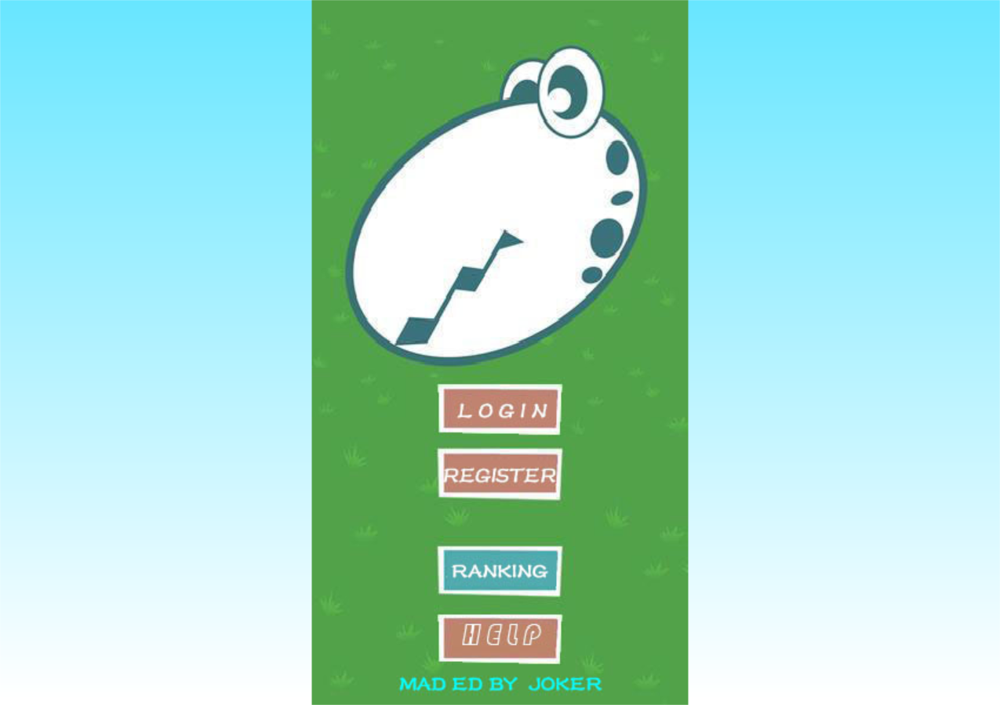
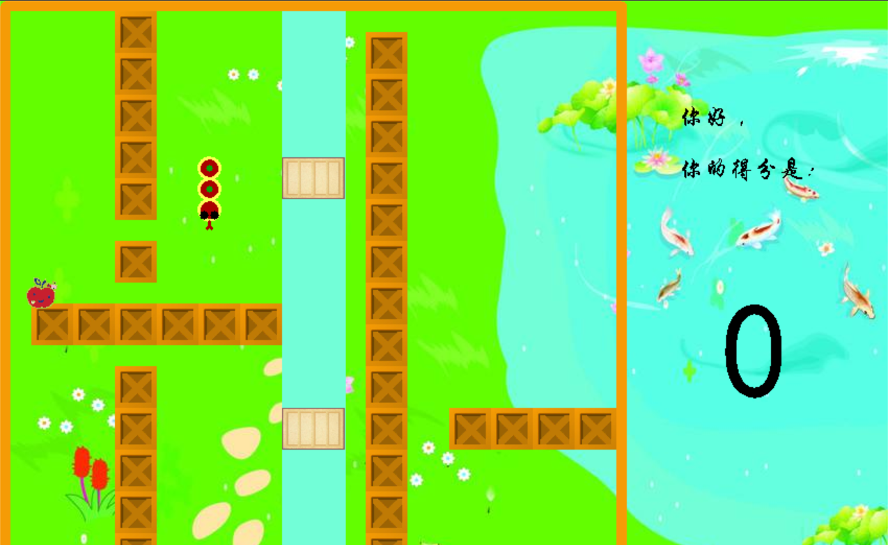

# **Retro-Snake**  Easyx版本 运行环境VS2017

## 部分文件说明

> Easyx 版本： EasyX库(附带graphics.h) 2018春分版 (2018-3-21)  

### Snakeprev.h**  

1. 蛇节点声明 ```struct snake;```
2. 蛇存储结构链表 ```snake * snakelist(int,int*);```
3. 增加节点方法 ```void addsnake(snake *);```
4. 绘画蛇身 ```void drawsnake(snake *,char);```
5. 清空蛇 ```void clearsnake(snake *);```

### **mapgraph.h**

主要是页面布局 背景（box map)的制作 布局

### **main.cpp**

主要方法如下

```c++
void welcomegraph();//欢迎界面
void Finish();//结束界面
int clickcontrol();//鼠标控制
void Movingsnake(char);//蛇身移动控制
void Changesnakebody(int ,int );//蛇身改变控制
void Eating();//吃到食物的操作
int Deadjudge();//死亡判断
```

### 运行截图

- **Start**  



- **Run**



- **Over**


### 注意事项及运行说明

**WASD：**　来操控蛇的上下左右移动 注意打开英文输入  
**初始界面：** 用户名及密码只是模拟 回车键确定输入  
**EXE目录：** exe文件在debug目录下 release发布因为其优化运行出错  
**To Be Continue...**
> Easyx 下载地址 `https://www.easyx.cn/downloads/`  
> 更新 2018-9-10
